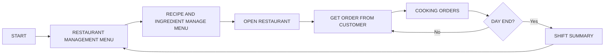

# [How to survive by open the restaurant to monsters] — Core Loop & Gameplay

## Core Loop

## Core Mechanics

1. ORDER TAKING (รับออเดอร์จากลูกค้าที่หลากหลาย)
2. COOKING DYNAMIC (ประกอบส่วนประกอบต่างๆ ของเมนู)
3. RESTAURANT UPGRADE (อัพเกรดร้านอาหารให้มี facilities มากขึ้น)
4. RECIPE MANAGEMENT (บริหารจัดการวัตถุดิบให้เหมาะสมกับเมนูที่จะเปิดในวันนั้น)
5. EMPLOYEE MANAGEMENT (จัดจ้างลูกจ้างเพื่อเบาภาระงานในร้าน)

## Controls

|   Key   | Action         |
| :------: | -------------- |
|    w    | move upward    |
|    a    | move left      |
|    s    | move downward  |
|    d    | move right     |
| spacebar | interact       |
|   esc   | setting / exit |

## Win / Lose Condition

- **ชนะเมื่อ:** [PROFIT REACH THE GOAL IN TIME]]
- **แพ้เมื่อ:** [CANT REACH THE GOAL IN TIME]
