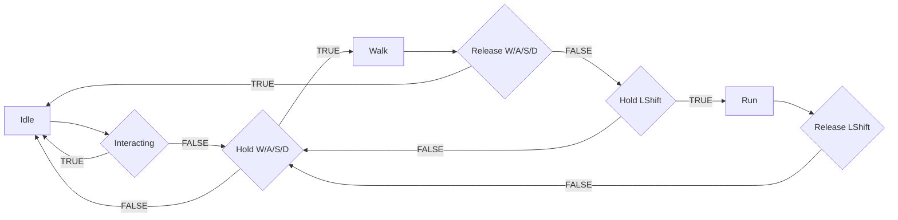
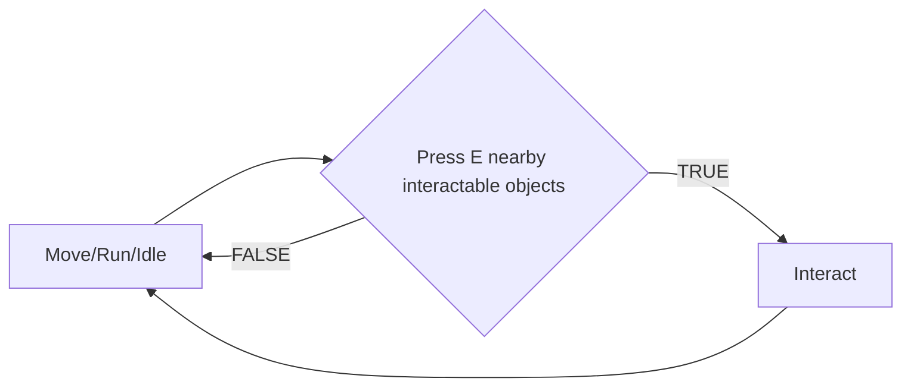

# Mechanic Design — [Movement]

## State Diagram

## Rules

| State | เข้าเงื่อนไข                        | ออกเงื่อนไข                     | Note           |
| ----- | ----------------------------------------------- | ------------------------------------------ | -------------- |
| Idle  | เริ่มเกม / หยุดเคลื่อนที่ | กด input ใดๆ                          | Animation loop |
| Move  | กดปุ่มทิศทาง                        | ปล่อยปุ่ม / กดปุ่ม Interact | Speed = 3 px   |
| Run   | กดปุ่มทิศทางพร้อม LShift       | ปล่อยปุ่ม / กดปุ่ม Interact | Speed = 5 px   |

# Mechanic Design — [Interact]

## State Diagram

## Rules

| State    | เข้าเงื่อนไข                                               | ออกเงื่อนไข                             | Note           |
| -------- | ---------------------------------------------------------------------- | -------------------------------------------------- | -------------- |
| Idle     | ตัวละครอยู่ในสถานะที่สามารถ interact ได้ | กด input ใดๆ                                  | Animation loop |
| Interact | กด E ใกล้วัตถุที่สามารถ interact ได้            | สิ้นสุด interact ของวัตถุนั้นๆ | Animation loop |
