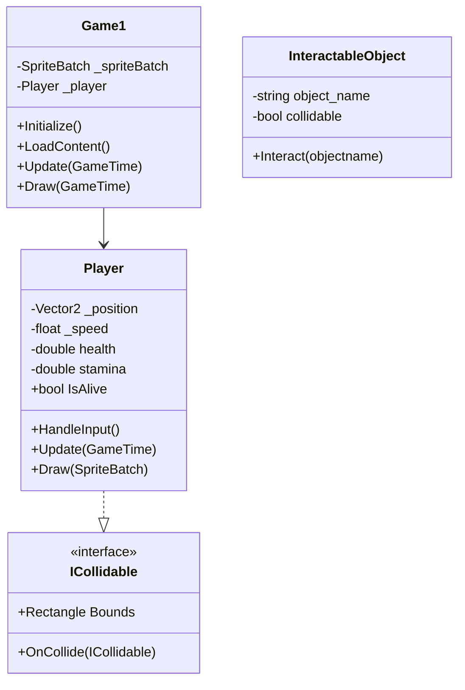

# Class Diagram — [PROJECT THE ELECT]

```mermaid
classDiagram
    class Game1 {
        -SpriteBatch _spriteBatch
        -Player _player
        +Initialize()
        +LoadContent()
        +Update(GameTime)
        +Draw(GameTime)
    }
    class Player {
        -Vector2 _position
        -float _speed
	-double health
	-double stamina
        +bool IsAlive
        +HandleInput()
        +Update(GameTime)
        +Draw(SpriteBatch)
    }
    class ICollidable {
        <<interface>>
        +Rectangle Bounds
        +OnCollide(ICollidable)
    }
	class InteractableObject{
		-string object_name
		-bool collidable
		+Interact(objectname)
	}

    Game1 --> Player
    Player ..|> ICollidable
```
