# 48-Hour Timeline — [Vier Select]

| หัวข้อ                             | รายละเอียด                   |
| ---------------------------------------- | -------------------------------------- |
| Time Keeper                              | (ใช้อุปกรณ์จับเวลา)  |
| Jam เริ่มจริง (วัน-เวลา) | 24 ก.ค. 2569 12:00 น.               |
| Deadline ส่งงาน (วัน-เวลา)  | 26 ก.ค. 2569 12.00 น.               |

> คำนวณ "เวลาจริง" ของแต่ละ Phase จาก **เวลาที่ Jam เริ่มจริง** ด้านบน แล้วเติมในคอลัมน์ขวาสุด — ใช้ตารางนี้เป็นจุดอ้างอิงเดียวของทีมตลอด 48 ชม.

| Phase                                       | ช่วง (Hour)  | เวลาจริง (Hour 0 = เวลาเริ่ม Jam) | เป้าหมาย / Deliverable                                                                   | สถานะ | เวลาจริงที่เสร็จ |
| ------------------------------------------- | ---------------- | -------------------------------------------------- | ------------------------------------------------------------------------------------------------ | ---------- | -------------------------------- |
| 0. Kickoff & Ideation                       | 0–2 (2 hrs)     | 12:00 - 14:00                                      | รู้ theme, brainstorm, ล็อกคอนเซปต์ + core loop 1 บรรทัด                    | 🔲         |                                  |
| 1. Planning & Setup                         | 2-5 (3 hrs)      | 14:00 - 17:00                                      | GDD one-pager, ตกลง pipeline, ตั้ง repo, แบ่งงาน                                  | 🔲         |                                  |
| 2. Core Pipeline & Skeleton                 | 5 - 13 (8 hrs)   | 17:00 - 01:00                                      | Game loop โครงหลักรันได้ (state, input, render ว่างเปล่า)                 | 🔲         |                                  |
| 3. Core Mechanic                            | 13 - 23 (10 hrs) | 01:00 - 11:00                                      | กลไกหลักเล่นได้จริง 1 อย่าง —**Playable Build Checkpoint**        | 🔲         |                                  |
| 4. Content & Feature Build-out              | 23 - 33 (12 hrs) | 11:00 - 23:00                                      | ด่าน/เนื้อหา, UI/HUD, เสียง, กลไกรอง                                      | 🔲         |                                  |
| 5. 🔒 Feature Freeze                        | ที่ Hour 33   | 23:00                                              | **ห้ามเพิ่ม feature ใหม่หลังจุดนี้** ทุกคน merge เข้า main | 🔲         |                                  |
| 6. Polish & Bugfix                          | 33 - 39 (8 hrs) | 23:00 - 07:00                                      | แก้บั๊ก, ปรับ balance, juice/feedback เล็กๆ                                      | 🔲         |                                  |
| 7. Testing (คนนอกทีมลองเล่น) | 39 - 41 (2 hrs)  | 07:00 - 09:00                                      | playtest, จด bug ที่เหลือ, แก้เฉพาะตัวที่ critical                       | 🔲         |                                  |
| 8. Build & Package                          | 41 - 46 (2 hrs)  | 09:00 - 11:00                                      | สร้าง build จริง, ทดสอบบนเครื่องอื่น, เตรียมหน้า submission | 🔲         |                                  |
| 9. Buffer & Submit                          | 47–48 (1 hrs)   | 11:00 - 12:00                                      | เผื่อเวลาหน้างาน, ส่งงานก่อนเวลาอย่างน้อย 15 นาที     | 🔲         |                                  |

```mermaid
gantt
    dateFormat HH:mm
    axisFormat %m/%d %H:%M
    title GameJam Plan

    section Plan
    Idea :a1, 2026-07-24 12:00 , 2h
    Planning & Setup :after a1,2026-07-24 14:00, 3h
    Core Pipeline & Skeleton : after a2, 8h
    Core Mechanic : after a2,2026-07-25 01:00, 10h
    Content & Feature Build-out : 2026-07-25 11:00, 12h
    🔒 Feature Freeze : 2026-07-25 23:00
    Polish & Bugfix : 2026-07-25 23:00,8h
    Beta Test : 2026-07-26 07:00,2h
    Build : 2026-07-26 09:00,2h
    Sub : 2026-07-26 11:00, 1h
```

## กติกา Checkpoint

- ถ้าถึงเวลาใน Phase ใดแล้วยังไม่เสร็จ → **Time Keeper** เรียกประชุมด่วน (ไม่เกิน 5 นาที) เพื่อตัด scope ทันที ตาม cut-list ใน [01-pipeline-checklist.md](01-pipeline-checklist.md)
- ห้ามปล่อยให้ Phase ที่ล่าช้าลากยาวไปกระทบ Phase ถัดไปเกิน [1 ชม.]
- อัปเดตคอลัมน์ "สถานะ" และ "เวลาจริงที่เสร็จ" ทุกครั้งที่ปิด Phase เพื่อให้ทั้งทีมเห็นความคืบหน้าตรงกัน
